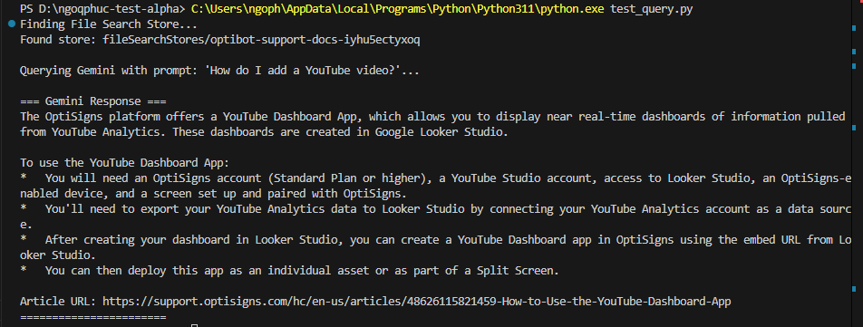

# OptiBot Mini-Clone (Gemini Edition)

A lightweight, stateless daily sync job that scrapes help center articles from [support.optisigns.com](https://support.optisigns.com), converts them to clean Markdown, and syncs them to a Google Gemini File Search Store for use with a Gemini Assistant.

Using the Google Gemini API (via Google AI Studio) is **100% free** under the free tier (up to 15 RPM and 1 million TPM), making it an excellent, cost-effective alternative to OpenAI.

## Architecture & Design Decisions

### 1. Stateless Delta Detection
To run efficiently as a daily job in ephemeral environments (like DigitalOcean Jobs, Railway, or AWS) without requiring an external database or persistent volume, we use a **stateless delta detection** mechanism.
- We encode metadata in the display names of the files uploaded to the Gemini File Search Store:
  `optibot_{article_id}_{updated_timestamp}_{title_slug}.md`
- On each run, the script queries the Gemini File Search API to get all existing documents in the store.
- It parses the `article_id` and `updated_timestamp` from the display names.
- It compares this remote state with the latest scraped articles from Zendesk:
  - **Added**: If an article ID is not present in Gemini, it is uploaded and indexed.
  - **Updated**: If an article ID is present but its Zendesk `updated_at` timestamp is newer than the remote timestamp, the old document is deleted from Gemini and the new one is uploaded.
  - **Skipped**: If the article ID exists and the timestamps match, nothing is done.
  - **Deleted**: If a document exists in Gemini but is no longer in the active scraped list, it is deleted to keep the store clean.

### 2. Chunking & Embedding Strategy
We leverage Gemini's native **File Search Store** for chunking and embedding:
- **Chunking**: Gemini automatically parses and splits the Markdown files into optimal semantic chunks.
- **Embeddings**: Documents are embedded using Google's high-performance embedding models (e.g., `gemini-embedding-2` or the default text embedding model).
- **Metadata Citation**: We prepend `Article URL: <url>` to the top of every Markdown file. This ensures that when the Gemini model retrieves a chunk, it always has access to the source URL and can cite it verbatim in its response.

---

## Setup & Local Execution

### Prerequisites
- Python 3.9+ or Docker
- A Gemini API Key (obtain a free key instantly from [Google AI Studio](https://aistudio.google.com/))

### 1. Local Python Setup
1. Clone this repository.
2. Create a virtual environment and activate it:
   ```bash
   python -m venv .venv
   # On Windows:
   .venv\Scripts\activate
   # On macOS/Linux:
   source .venv/bin/activate
   ```
3. Install dependencies:
   ```bash
   pip install -r requirements.txt
   ```
4. Create a `.env` file from the sample:
   ```bash
   cp .env.sample .env
   ```
5. Configure your `API_KEY` (your Gemini API key) in `.env`.

### 2. Run Locally
To run the sync job locally:
```bash
python main.py
```
This will scrape the articles, save them as `.md` files in a local `articles/` directory, and sync them to your Gemini File Search Store.

### 3. Run with Docker
You can build and run the container locally:
```bash
# Build the image
docker build -t optibot-sync .

# Run the container (passing your Gemini API Key)
docker run -e API_KEY=your_gemini_api_key_here optibot-sync
```

---

## Deployment & Automation (GitHub Actions)

This project is configured to run automatically once a day using **GitHub Actions**. This is a 100% free solution that does not require any cloud hosting costs or credit cards.

### Setup GitHub Actions
1. Go to your GitHub repository.
2. Navigate to **Settings** -> **Secrets and variables** -> **Actions**.
3. Click **New repository secret**.
4. Name the secret **`API_KEY`** and paste your Gemini API key as the value.
5. Click **Add secret**.

### How it runs:
- **Automatically**: The job runs daily at midnight UTC via a cron schedule.
- **Manually**: You can trigger the job at any time by going to the **Actions** tab, selecting the **Daily OptiBot Sync** workflow, and clicking **Run workflow**.

- **Daily Job Logs**: https://github.com/ngophuc29/ngoqphuc-test-alpha/actions


---

## Gemini Assistant Configuration in Google AI Studio

To set up your assistant in [Google AI Studio](https://aistudio.google.com/):

1. Click **Create new prompt** -> **Chat Prompt** or use the **Agent/Assistant** feature when available.
2. Select the model **`gemini-2.5-flash`** or **`gemini-1.5-flash`**.
3. In the **System Instructions**, paste the following verbatim:
   ```text
   You are OptiBot, the customer-support bot for OptiSigns.com.
   • Tone: helpful, factual, concise.
   • Only answer using the uploaded docs.
   • Max 5 bullet points; else link to the doc.
   • Cite up to 3 "Article URL:" lines per reply.
   ```
4. Under **Tools**, enable the **File Search** or **RAG** tool, and select the **`OptiBot Support Docs`** store.
5. Ask: `"How do I add a YouTube video?"`.
6. Take a screenshot of the correct response showing the answer and citations, and save it in the root of the project as `playground_screenshot.png`.

### Sanity Check Answer
Below is a placeholder for your screenshot showing the assistant answering the sample question with cited URLs:


